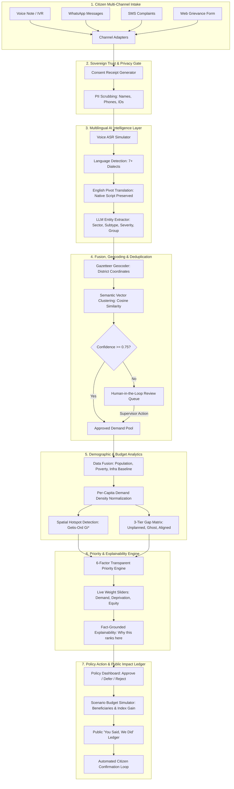

# JanaSetu (जनसेतु)
### Multilingual Citizen Demand Intelligence Platform — Digital Public Good for BRICS Nations

[](LICENSE)
[](https://digitalpublicgoods.net/)
[](#sovereign-data-governance)

---

## 1. Overview & Problem Statement
Governments across emerging economies struggle to consolidate citizen feedback and align it with national infrastructure capital allocations. Development requests live in fragmented, disconnected channels (IVR voice notes, WhatsApp community groups, SMS, local petitions), leading to:
- **Misaligned Capital Spending**: Affluent urban corridors receive surplus allocations ("Ghost Projects") while critical rural deficits go unfunded.
- **Linguistic Marginalization**: Non-official and minority dialect speakers are silenced by text-heavy, single-language web portals.
- **Zero Civic Verification**: Citizens never receive confirmation when projects are delivered, undermining institutional trust.

**JanaSetu** ("Bridge of the People") is a sovereign, open-source **Digital Public Good (DPG)** that ingests citizen infrastructure requests across voice, text, and messaging in 7+ languages, fuses them with demographic indices and planned public investments, detects spatial demand hotspots and funding gaps, and outputs explainable, equity-weighted project recommendations to policymakers.

---

## 2. End-to-End Pipeline Architecture



---

## 3. Digital Public Good (DPG) Standard Alignment

JanaSetu has been architected from the ground up to satisfy the 9 indicators of the **Digital Public Goods Standard**:
1. **Relevance to SDGs**: Directly advances **SDG 9** (Industry, Innovation & Infrastructure), **SDG 10** (Reduced Inequalities), **SDG 11** (Sustainable Cities & Communities), and **SDG 16** (Peace, Justice and Strong Institutions).
2. **Open Software License**: Released under the OSI-approved **Apache License 2.0**.
3. **Clear Ownership**: Maintained as an open-source civic repository with explicit governance models.
4. **Data Privacy & Protection**: Compliant with in-country sovereign privacy mandates:
   - **India**: Digital Personal Data Protection (DPDP) Act, 2023.
   - **Brazil**: Lei Geral de Proteção de Dados (LGPD) - Lei nº 13.709.
   - **South Africa**: Protection of Personal Information Act (POPIA), 2013.
   - **Russia**: Federal Law on Personal Data No. 152-FZ.
   - **China**: Personal Information Protection Law (PIPL), 2021.
5. **Algorithmic Fairness & Bias Monitoring**: Built-in demographic disparity tracker auditing request rates per 1,000 citizens by district, urban vs. rural split, and gender balance.
6. **Immutable Audit Trail**: Cryptographic SHA-256 signature chain recording every AI extraction, supervisor override, and policymaker capital allocation.
7. **Extraction of Data**: De-identified citizen demand aggregates exportable in open tabular formats.
8. **Pluggable & Offline Capable**: Supports zero-key deterministic mock intelligence for offline sovereignty alongside cloud LLM providers (Gemini).
9. **Accessibility & Localization**: Multilingual UI with full English and Hindi (हिंदी) localization dictionaries.

---

## 4. Technology Stack

- **Backend**: Python 3.9+, FastAPI, SQLite, Pydantic v2, Uvicorn, Requests.
- **Frontend**: React 19, Vite 8, Tailwind CSS v4, Leaflet & React-Leaflet, Recharts, Lucide Icons.
- **AI / NLP**: Pluggable provider architecture with `DeterministicMockProvider` (instant, reproducible, zero API keys required) and `GeminiProvider`.

---

## 5. Quick Start (Single-Command)

### Prerequisites
- Node.js (v18+) & npm
- Python (v3.9+)

### One-Command Launch
```bash
git clone https://github.com/example/janasetu.git
cd "NAGRIK AI 2"
./run.sh
```

The launcher will automatically configure virtual environments, seed ~1,500 synthetic multilingual citizen requests across BRICS, and start both servers:
- **Policy Dashboard**: [http://localhost:5173](http://localhost:5173)
- **Backend REST API**: [http://localhost:8000](http://localhost:8000)
- **Interactive Swagger Docs**: [http://localhost:8000/docs](http://localhost:8000/docs)

---

## 6. Seeded Stories & Demo Walkthrough

1. **Critical Unplanned Gap — Bundelkhand Water Crisis (India)**:
   - Over 200+ verified citizen grievances reporting dried tubewells, borewell failures, and private tanker exploitation in Banda, Mahoba, and Chitrakoot.
   - Planned government investment is **$0.0M** against a **$3.8M** capital requirement.
   - Top-ranked by Priority Engine due to **0.76 Poverty Index** and **85% infrastructure deficit**.
2. **Aligned Priority — Dharavi Sanitation & Drainage (India)**:
   - High-density urban complaints regarding monsoon sewer overflow.
   - Government budget of **$14.5M** aligns directly with high citizen demand.
3. **Ghost Allocation — Affluent Metropolitan Corridors**:
   - South Delhi ($18.5M smart broadband budget with only 4 citizen requests) and Pinheiros/Sandton.
   - Flagged by the Gap Matrix for fiscal scrutiny and capital reallocation to peripheral districts.
4. **Human Review Queue**:
   - Low-confidence items (ambiguous colloquial phrasing or dialect slang) routed to human supervisors for verification before inclusion into the demand pool.
5. **Civic Confirmation Loop**:
   - Public "You Said, We Did" ledger displaying baseline vs. follow-up indices with simulated citizen satisfaction verification polls.

---

## 7. License
Licensed under the [Apache License, Version 2.0](LICENSE).
